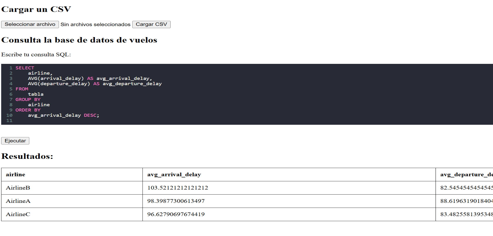

# README: Aplicación Flask con SQLite

Este README proporciona instrucciones detalladas para crear un entorno de desarrollo y levantar una **aplicación Flask** que permite subir archivos **CSV** para crear una base de datos **SQLite** y realizar consultas SQL a través de una interfaz web.

## Requisitos Previos
- **Python 3.x** instalado.
- **pip** (gestor de paquetes de Python).
- Conexión a Internet para descargar las dependencias necesarias.

## Paso 1: Crear el Entorno Virtual de Python
1. Abre una terminal o el símbolo del sistema y navega hasta el directorio donde quieras crear el proyecto.
2. Crea un entorno virtual llamado `sql-app2` con el siguiente comando:
   ```bash
   python -m venv sql-app2
   ```

3. Activa el entorno virtual:
   - En **Windows (PowerShell)**:
     ```powershell
     .\sql-app2\Scripts\Activate
     ```
   - En **Windows (cmd)**:
     ```cmd
     sql-app2\Scripts\activate
     ```
   - En **Linux/macOS**:
     ```bash
     source sql-app2/bin/activate
     ```

## Paso 2: Instalar las Dependencias
Con el entorno virtual activado, instala las dependencias necesarias:
```bash
pip install Flask pandas
```

Estas librerías se usarán para desarrollar la aplicación Flask y para procesar los archivos CSV.

## Paso 3: Ejecutar la Aplicación Flask
Con el entorno virtual activado y las dependencias instaladas, ejecuta la aplicación Flask:

1. Clona el repositorio desde GitHub (suponiendo que el código está en GitHub):
   ```bash
   git clone https://github.com/MarioSantanaTajamar/sql-lite
   ```
   Navega hasta el directorio del proyecto clonado:
   ```bash
   cd sql-app
   ```

2. Ejecuta la aplicación Flask:
   ```bash
   python app.py
   ```

Esto iniciará el servidor en `http://127.0.0.1:5000/`. Abre tu navegador y visita esa dirección para acceder a la aplicación.

## Paso 4: Uso de la Aplicación
1. **Cargar CSV**:
   - Utiliza el formulario para **subir un archivo CSV**. Los datos del archivo se cargarán en una tabla SQLite.
  
2. **Hacer Consultas SQL**:
   - Usa el cuadro de texto para escribir consultas **SQL** y ver los resultados en una tabla HTML.
   - Ejemplo de consulta:
     ```sql
     SELECT * FROM tabla ;
     ```

## Notas
- La aplicación creará una base de datos llamada **`flights.db`** y una tabla llamada **`vuelos`** basada en las columnas del CSV cargado.
- La funcionalidad de consulta SQL permite realizar consultas directas sobre los datos del CSV.

Esta aplicación proporciona una interfaz amigable para **subir archivos CSV**, **crear tablas SQLite**, y **consultar los datos** usando **SQL**, todo desde una página web.

